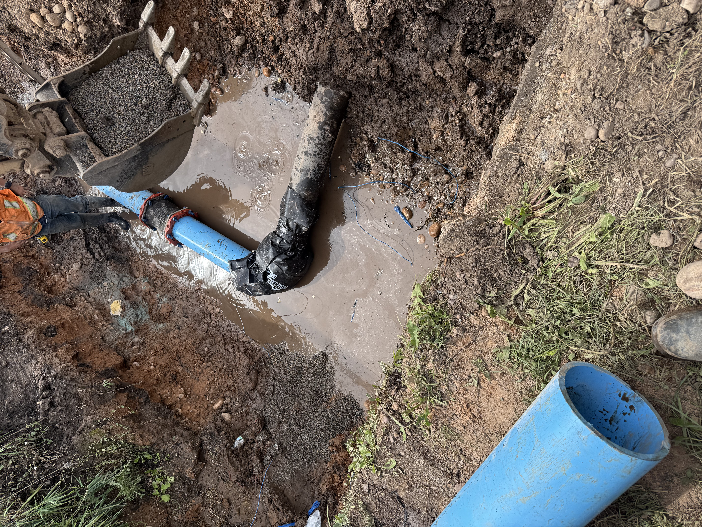
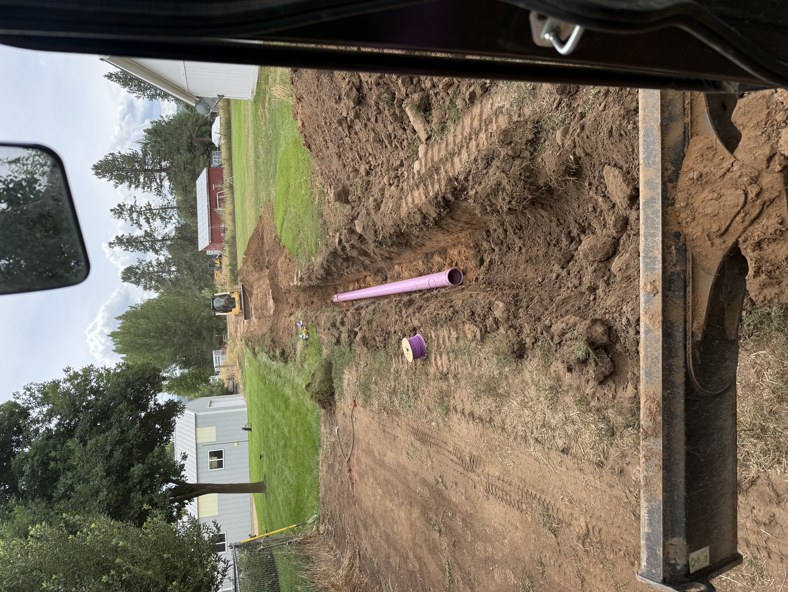
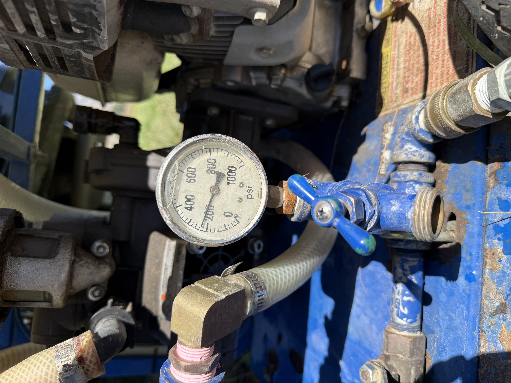

Installing and connecting underground utilities along the Wasatch Front is rarely as simple as digging a straight trench and dropping pipe in the ground. 

Between established neighborhoods with active water mains, high-traffic municipal roadways that cannot be open-cut, and strict city inspection standards, utility excavation requires specialized equipment and precise field execution.

When connecting new commercial developments, subdivisions, or secondary water infrastructure to municipal supplies, contractors rely on three critical engineering techniques: **hot tapping live mains**, **trenchless directional boring**, and **hydrostatic pressure testing**.

Here is how each process works in the field and why they matter for Northern Utah construction projects.

## 1. Hot Tapping: Connecting Live Water Mains Without Shutting Down the Grid

In the past, connecting a new branch line or fire suppression main to an existing municipal water line required shutting down the district main. That meant issuing boil-water notices, draining thousands of gallons of treated water, interrupting service to hundreds of residents, and risking contamination or pressure surges when the line was recharged.

Today, we use **hot tapping** (also known as wet tapping or live line tapping) to make service connections under full municipal line pressure.

<figure class="my-8 mx-auto max-w-3xl border border-gray-200 rounded-lg overflow-hidden bg-white shadow-sm">
  <video src="/video/hot-tapping-water-main-accurite-excavation.mp4" poster="/images/blog/hot-tapping-water-main-poster.jpg" class="w-full h-auto block" controls muted loop playsinline preload="metadata" aria-label="Video of AccuRite Excavation performing a live hot tap on a culinary water line in Northern Utah"></video>
  <figcaption class="p-4 bg-gray-50 border-t border-gray-200 text-center text-sm text-gray-500">AccuRite Excavation hot tapping a live culinary water line. The specialized tapping machine cuts into the pipe through an open tapping sleeve and valve while the line remains fully pressurized.</figcaption>
</figure>

### How the Hot Tapping Process Works:
1. **Expose and Prep the Main:** The existing pipe (ductile iron, C900 PVC, or asbestos cement) is carefully potholed using [vacuum excavation](/blog/vacuum-excavation-utility-potholing-utah) and cleared of corrosion.
2. **Mount the Tapping Sleeve & Valve:** A heavy-duty, bolted tapping sleeve with a rubber seal is torqued onto the existing line, and a permanent resilient wedge gate valve is bolted to the sleeve outlet.
3. **Attach the Tapping Machine:** A specialized drill assembly mounts to the face of the open valve, creating a watertight seal.
4. **Cut the Coupon:** The cutter advances through the open valve and cuts a clean hole (the coupon) out of the main pipe wall.
5. **Retract and Isolate:** The cutter and the removed coupon are retracted back into the machine housing past the gate valve. The valve is closed, and the tapping machine is depressurized and unbolted.

The result is a fully functional, valved branch connection ready for the new lateral line—with zero water loss and zero disruption to the surrounding neighborhood.

## 2. Directional Boring: Crossing Roadways Without Open Trenching

When a new utility line must cross a paved municipal road, highway, or established landscaped corridor, open-trenching creates major headaches: traffic detours, permit delays, expensive asphalt restoration, and permanent pavement dips.

To avoid surface disruption, we transition between standard PVC pipe and **High-Density Polyethylene (HDPE) pipe** installed via Horizontal Directional Drilling (HDD).

### Why HDPE for Trenchless Road Crossings?
- **Tensile Strength:** Continuous HDPE pipe strings are fusion-welded and pulled through the reamed borehole under roads without joint separation.
- **Flexibility:** HDPE easily handles minor directional curvature under buried storm drains and existing utility corridors.
- **Flanged Mechanical Transitions:** As shown in the photo above, once the HDPE emerges in the excavation receiving pit, it is connected to standard C900 PVC distribution lines using engineered mechanical restraint couplings and flange adapters.

This method keeps Wasatch Front roads intact while delivering full utility capacity beneath the surface.

## 3. Secondary Water vs. Culinary Infrastructure: The Purple Pipe Rule

In Northern Utah communities across Weber, Davis, and Salt Lake counties, water infrastructure is divided into two separate systems: **potable culinary water** (drinking and domestic use) and **secondary irrigation water** (untreated canal and reservoir water for lawns and landscaping).

To eliminate cross-connection contamination, strict plumbing and civil codes govern secondary water installations.

### Key Rules for Utah Secondary Water Lines:
- **Color Coding (Purple Pipe):** All secondary water mains, laterals, and valve boxes must use dedicated purple PVC/poly pipe or purple tracer tape to clearly distinguish them from blue culinary water lines.
- **Horizontal & Vertical Separation:** Secondary lines must maintain minimum clearance distances from culinary lines to prevent cross-contamination during ground settlement or pipe maintenance.
- **Backflow Prevention:** Strict air gaps and approved backflow preventers ensure non-potable irrigation water never enters household plumbing fixtures.

## 4. Hydrostatic Pressure Testing: 200 PSI for 2 Hours

Before any culinary or fire suppression water line can be backfilled, disinfected, and tied into a city system, it must pass a rigorous **hydrostatic pressure test** witnessed by the municipal building or water inspector.

Passing this test confirms that every mechanical joint, gasket, thrust block, and valve is seated properly and leak-free.

### What the Inspection Demands:
- **Test Pressure:** Lines are pumped with clean water up to **200 PSI** (or 1.5 times the working pressure, whichever is higher).
- **Test Duration:** The line must hold that continuous 200 PSI pressure for a minimum of **2 hours** without significant pressure drop.
- **Thrust Restraint Verification:** High test pressures place thousands of pounds of outward thrust on bends, tees, and dead-ends. Concrete thrust blocks or mechanical joint restraints must be properly engineered to prevent fittings from blowing off under load.

Once the hydrostatic test passes and bacteriological water samples return clear from the lab, the line receives final sign-off for full service.

## Professional Underground Utility Installation in Northern Utah

Cutting corners on underground utility installations leads to costly pavement repairs, failed inspections, and water main breaks. Whether your project requires wet tapping an active main, directional boring across an active roadway, or laying hundreds of feet of culinary and secondary pipe, you need a contractor with the right equipment and field experience.

AccuRite Excavation provides comprehensive [underground utility installation](/services/underground-utilities), [commercial site work](/services/commercial-projects), and [grading services](/services/grading-land-clearing) across [Ogden](/locations/ogden), [Layton](/locations/layton), [Clearfield](/locations/clearfield), and throughout Northern Utah.

[Request a free project estimate](/free-estimate) or call us at (801) 814-6975 to discuss your underground utility requirements.
