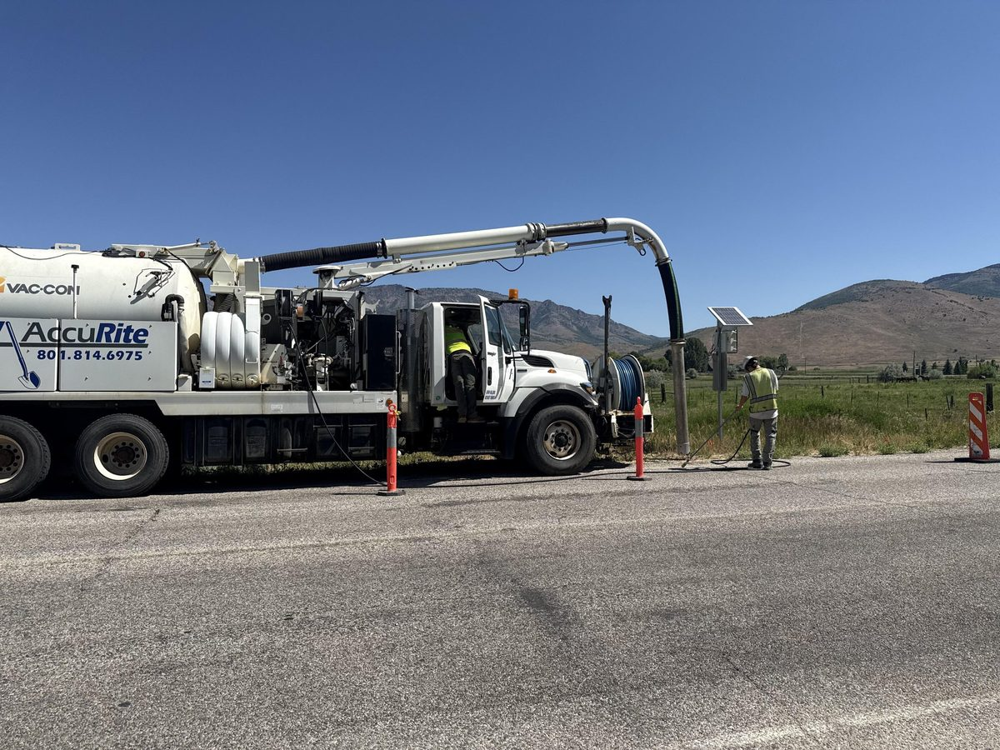
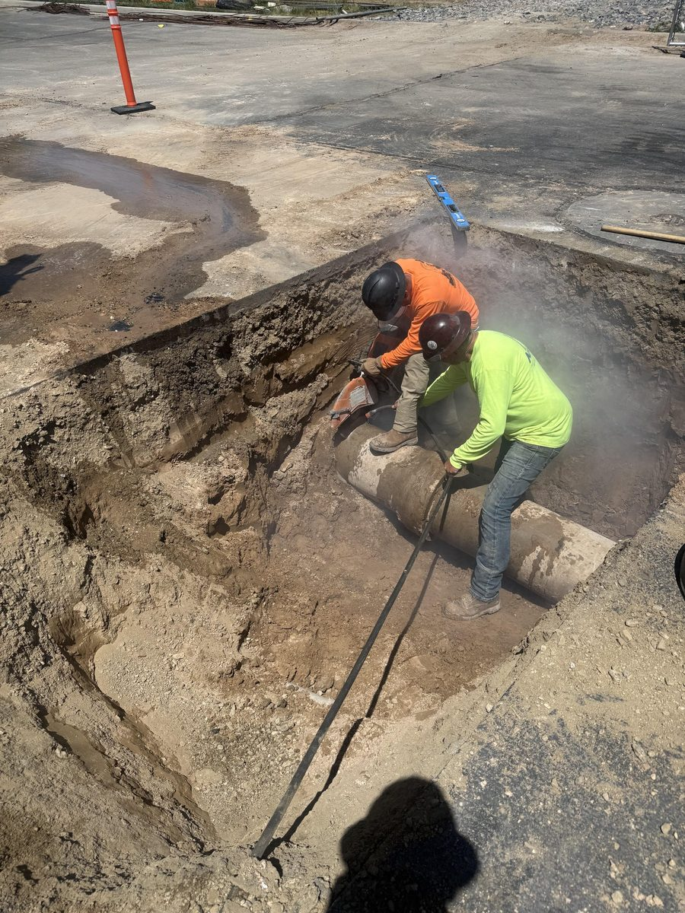

Every excavation job in Utah starts with the same question: what is already down there?

Under a typical street or commercial parking lot, the answer is gas, water, sewer, power, fiber, and irrigation — stacked at different depths, installed by different crews across different decades, and marked on drawings that may or may not reflect what actually got buried.

Hitting one of those lines is the fastest way to turn a routine dig into a very bad day. So before our excavator breaks ground, we find out where the utilities actually are.

## Locate Tickets Get You Close, Not Exact

Utah law requires notifying Blue Stakes of Utah 811 before excavating, and on a commercial job like ours there is no version of the work that skips it. We call on every site. The utility owners come out and paint the ground: yellow for gas, red for electric, blue for water, orange for communications.

Those marks are essential. They are also approximate.

A locate paints a corridor, not a coordinate. The line is somewhere in that stripe, at a depth nobody has told you. On older infrastructure the records can be off, and lines get moved, abandoned, or re-routed over the years without the drawings catching up. Digging blind inside a painted corridor with a steel bucket is still a gamble.

## Potholing: Actually Looking Before You Dig

The way to remove that gamble is to expose the utility and look at it. That process is called potholing, or daylighting — you open a small, precise hole down to the line, confirm exactly where it sits and how deep it runs, then plan the real excavation around a known object instead of a painted guess.

The question is how you open that hole without damaging the very thing you are trying to protect.

Vacuum excavation is the answer the industry settled on. Rather than cutting with a bucket, our truck breaks up the soil with a pressurized water jet and a powerful vacuum lifts the resulting slurry into a holding tank. There is no blade and no teeth anywhere near the pipe. The soil comes away and the utility is left sitting there intact, in daylight, exactly where you can see it.

It is the difference between finding a gas line and finding out about a gas line.

## Why We Own the Truck

Potholing is common. Owning the equipment to do it is less so — plenty of contractors rent the machine or sub the work out to a vacuum excavation company, which means their schedule now depends on somebody else's schedule.

AccuRite owns its vacuum excavator outright. That is a deliberate choice, and it changes how a job runs:

- **We pothole on our own timeline.** No waiting on a sub to fit us into their week before we can put a bucket in the ground.
- **The crew that exposes the line is the crew that digs around it.** Nothing gets lost in the handoff between two companies.
- **We can do it on short notice.** When a locate looks wrong, or a line turns up where no drawing shows one, we can put our own truck on site instead of stopping work and rescheduling.
- **It is not a line item we have to talk you out of.** Because we are not paying an outside vendor, potholing a questionable line is an easy call rather than a change-order argument.

## Where It Matters Most

Vacuum excavation earns its keep on the jobs where a mistake is expensive:

**Congested commercial sites.** Cutting into an existing parking lot or roadway means working in ground that is already full of service lines feeding a live building. There is rarely a clean place to dig.

**Tie-ins to live utilities.** Any time you connect new pipe to an existing main, somebody has to expose that main first. Doing it with a bucket is how mains get cracked.

**Deep or high-consequence lines.** High-pressure gas, primary electric, and fiber trunk lines are not things you probe with an excavator and hope.

**Landscaped and finished ground.** Vacuum excavation opens a hole the size of what it actually needs. On a finished site, the difference between a small pothole and a machine-dug test pit is the difference between a patch and a restoration bill.

## The Boring Outcome Is the Right One

There is no dramatic story to tell when this works. The line gets exposed, the crew sees where it is, the excavation goes in around it, and the job finishes on schedule. Nobody calls the gas company. Nobody evacuates a building. The parking lot gets its storm drain and the striping goes back down.

That is the entire point. Utility damage is not an unlucky accident that happens to careless contractors — it is a predictable outcome of digging where you cannot see. We would rather spend an hour with the vacuum truck than a day explaining what happened.

If your project involves digging anywhere near existing utilities, that is a conversation worth having before the equipment shows up. [Contact us for a free estimate](/free-estimate) and we will walk the site with you.
